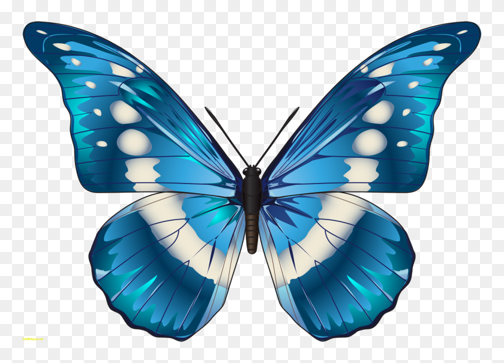

# Елена

Как здорово, что я пошла учиться на Java-разработчика в Неотология.

*Нетология* — это образовательная платформа, занимающийся онлайн-обучением пользователей в сфере интернет-маркетинга, программирования, дизайна, управления проектами, аналитики.

Я надеюсь, что стану хорошим специалистом.

Мои качества:
* целеустремленность
* познание
* уравновешенность
